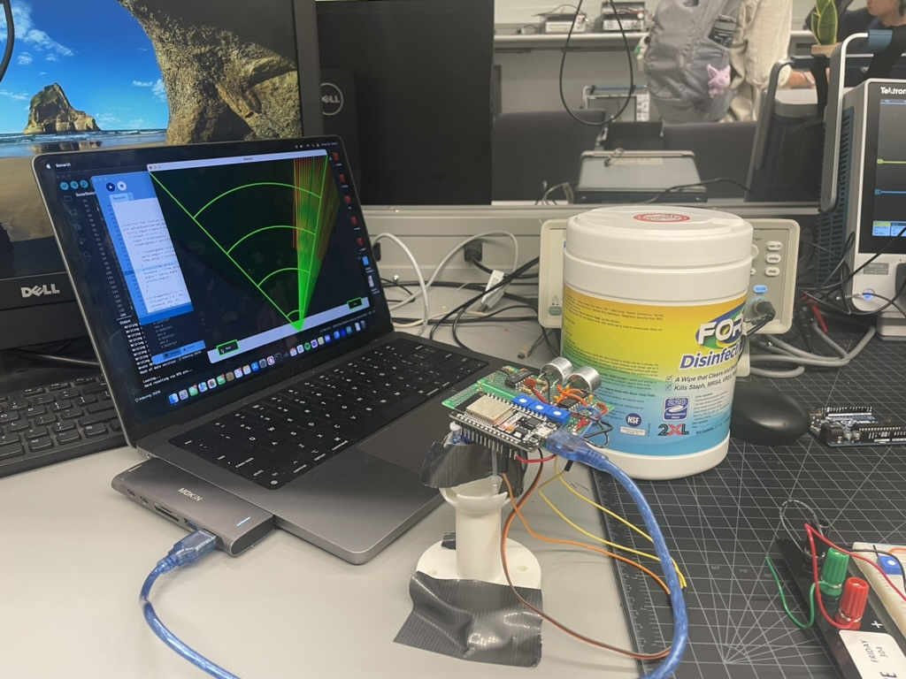
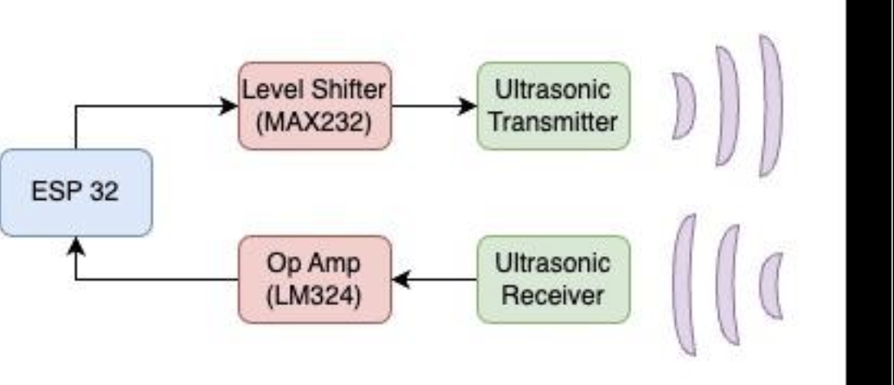
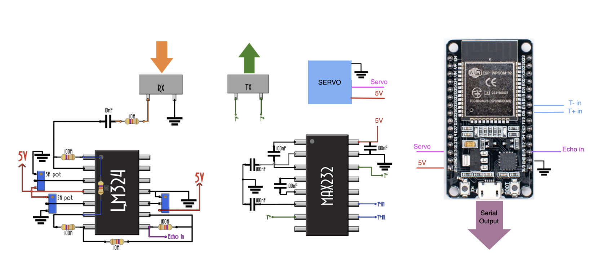

Title: Ultrasonic Sonar Project
Date: 2025-5-15 2:00
Category: Project

<!-- PELICAN_END_SUMMARY -->

## Overview

I built an ultrasonic sonar system using an ESP32 and custom circuitry. The system emits ultrasonic pulses, measures their return time, and visualizes object distance on a radar-style display. It mimics commercial sensors like the HC-SR04 but is fully built from low-level components and software.

## Design Summary

- **Transmitter:** Uses a level-shifted 40kHz square wave to excite an ultrasonic transducer. I used the MAX232 and capacitors to generate the 15V pulse required.
- **Receiver:** A 3-stage op-amp (LM324) circuit amplifies the weak echo signal. Careful DC offset tuning ensures ESP32 compatibility.
- **Signal Processing:** Distance is found by timing echoes using the ESP32 using micros().
- **Rotating Scan:** A servo sweeps the sensor across an area, and the ESP32 sends angle and distance to a Processing 4 script, which visualizes detected objects in real time.

## Key Challenges & Learnings

- **Op-Amp Sensitivity:** I learned to tune analog circuits using a signal generator and potentiometers. Finding the balance between noise and sensitivity proved difficult.
- **Software Timing Conflicts:** Running both the servo and sonar timing code on one ESP32 introduced errors. I learned the limits of precise timing on a single microcontroller and resolved it by writing a custom PWM function instead of using the Servo library. The sensor would perform much better with a dedicated microcontroller.
- **Noise & Artifacts:** The circuit was prone to noise. Though we added a high-pass filter, a more targeted band-pass would have been ideal.

## What I Took Away

This project strengthened my understanding of both analog signal design and embedded systems. From carefully creating and tuning op-amp circuits to writing low-level ESP32 code, it brought together theory and hands-on problem solving. 

## Detailed Writeup
This project was part of a final project for my circuits class, so here is a detailed writeup created by me and my partner:
[📄 View the full PDF report](images/ultrasonic-sensor/ECE%20Final%20Project.pdf)

