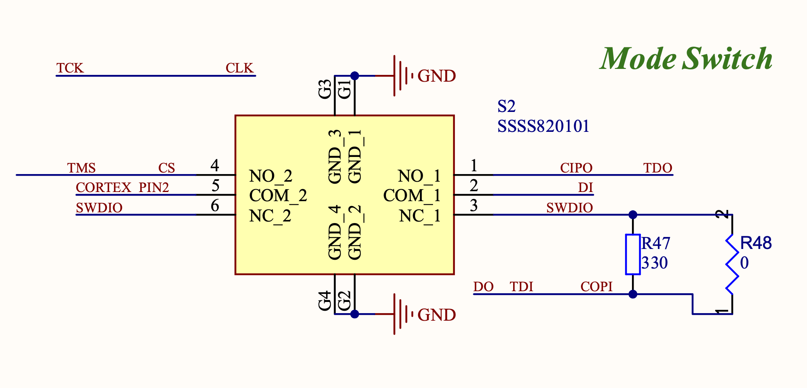

### Description

The BitArmyKnife is an all-in-one multitool for electronic communication. It is essentially a USB to everything converter with applications from serial communication debugging, flashing FPGA's, dumping flash chips, and interpreting low speed digital logic. Specifically, this chip combines an FTDI2232HL and a CypressFX2 based logic analyzer on one PCB, creating two separate devices on the same board.

Some features include:

- Level shifting to support a wide range of logic levels
- Clearly labeled 1.5 mm pin headers for each communication interface
- Indicator LEDs for data transmission and communication status

### Project Motivation

While designing flight computer PCBs for Princeton Rocketry and testing peripherals like GPS modules, compasses, and radios (all of which use serial communication), I found the need for a device independent of the system under test. This would let me validate communication between hardware peripherals without relying on unfinished flight computer firmware.

One specific example was when I implemented satellite communication on a high altitude glider using a RockBlock satellite modem. I needed to confirm that my ground station code was transmitting commands correctly over the Iridium satellite network, so I connected the RockBlock to my computer via the BitArmyKnife and was able to verify I was receiving data on the UART that would eventually be connected to the flight computer.

Very useful! I did not have to configure the flight computer or halt the development of other parts of the project at all – I was able to develop this system in isolation and integrate it quickly into the rest of the glider.

### Design Process

The BitArmyKnife began with a few goals in mind: interpreting various types of serial communication, and having the capability to decipher logic of an unknown signal. After some quick googling, I stumbled upon the Tigard project, an open source FT2232H USB to Serial board, which I took much inspiration from. I examined the Tigard Design and picked a few key decisions that I wanted to implement:

**Level Shifting**: BitArmyKnife supports 1.8V, 3.3V, and 5V logic levels, and I made sure to pick regulators large enough to power a connected device. There is even an option to use the voltage of the target source, which is often safer. This is accomplished by a SP4T switch that can select the logic level that powers the output side of a SN74LVC8T245PWR Bus Transceiver. So, the 3.3V logic from the FTDI chip enters one side of the buffer, and exits shifted to whatever logic level is selected by the switch.

**The Mode Switch:** The magic of this device is its ability to accommodate so many different communication protocols. This is done through a "Mode Switch" that simply connects and disconnects certain nets coming from the FT2232H to protocol specific header pins on the BitArmyKnife. To fully understand how it works, you need to know some things about the FTDI2232HL:

There are two channels on the chip (A and B). BitArmyKnife uses channel A exclusively as a UART. Channel B is where things get weird. Channel B is configured to use FTDI's MPSSE or Multi-Protocol Synchronous Serial Engine. According to AN_135 Application Note, "the MPSSE allows communication with many different types of synchronous devices, the most popular being SPI, I2C and JTAG."

It is important to know that SWD and I2C function differently than these other synchronous protocols because they have bidirectional data lines (SWDIO and SDA). This is solved by tying DO and DI together with a 330 ohm resistor when the Mode Switch is in SWD/I2C mode. The resistor enables the FTDI2232H and the device to read and write to the same line while limiting current into whichever pin (DO or DI) is not being used. Note, the 0 ohm jumper is not used normally; it can be used for fast signals and lengthy wires where signal integrity is more important than protection of the device.

I also knew that I wanted a primitive logic analyzer to decipher other kinds of digital signals, and after watching a few youtube videos about cheap FX2 LA's, I decided to add one to the PCB.

### Finished Result

The BitArmyKnife is working flawlessly so far! I have tested UART, SPI, and I2C communication, verifying that the FT2232HL was hooked up correctly and the mode switching works. I am very happy with the PCB aesthetically as well; my routing skills have matured and I put a lot of effort into planning out clean and optimal traces. I successfully used this tool to communicate with the RockBlock modem, a uBlox GPS, ht16k33 based 7 segment display, and a Teensy microcontroller.

I have not tested the logic analyzer (the semester started), but I can verify that the Cypress FX2 powers on and is recognized by my computer. I will continue to post about this device after I verify more of its features.
