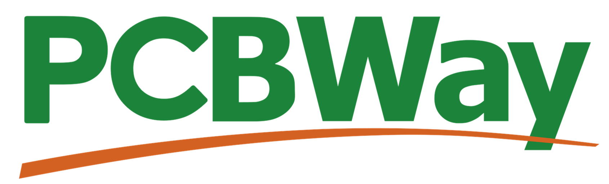
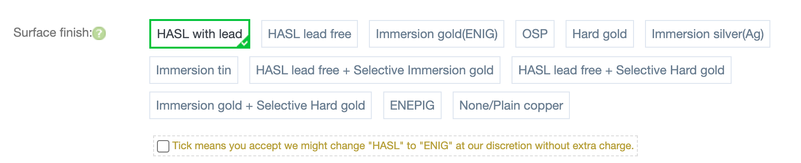
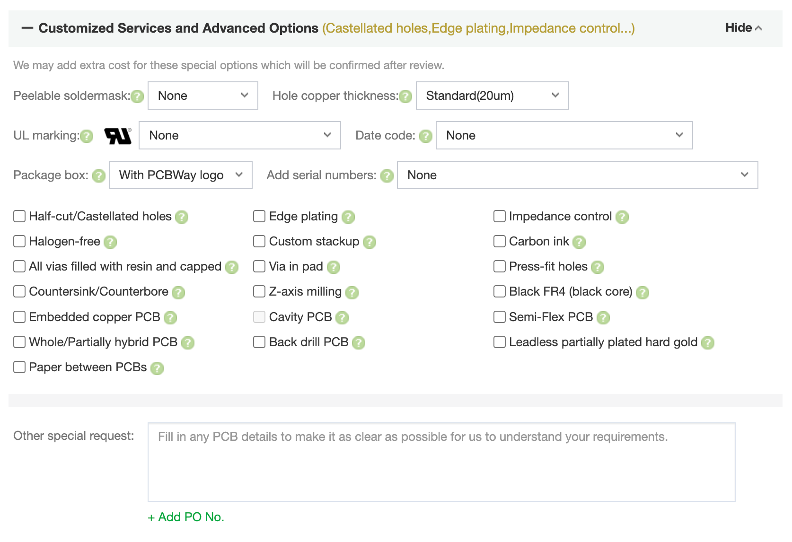
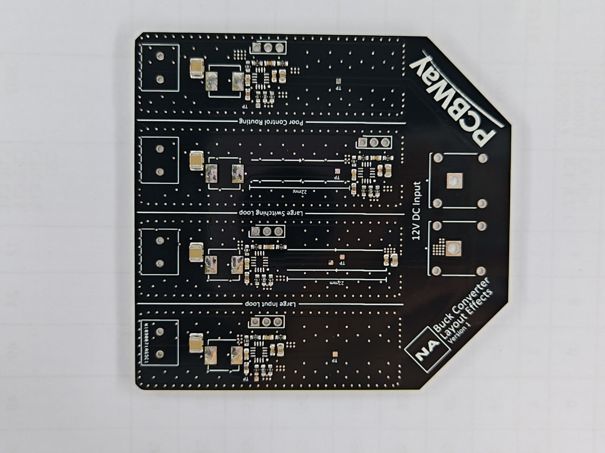
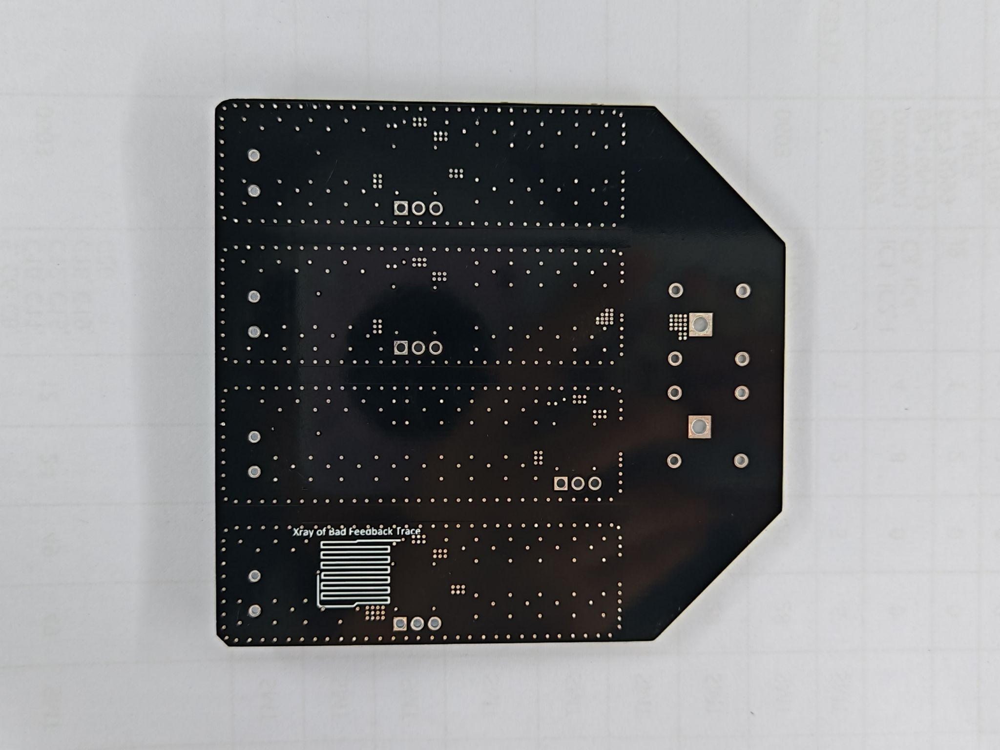
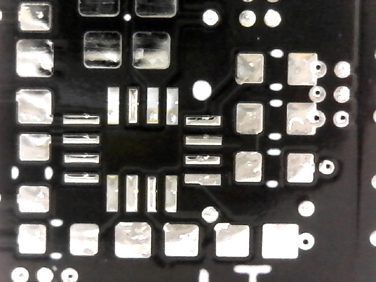
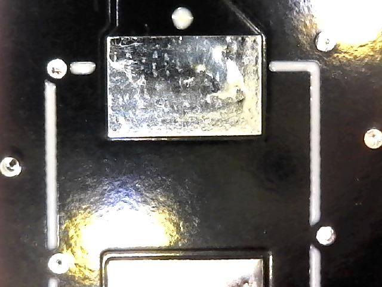
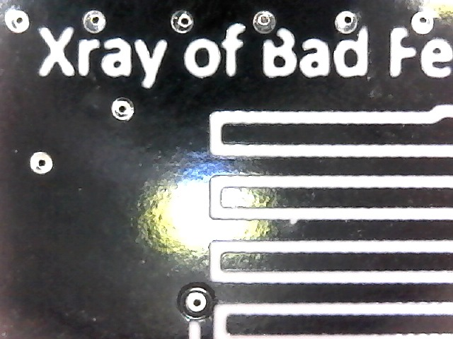
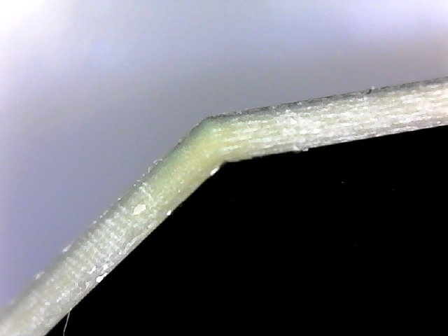
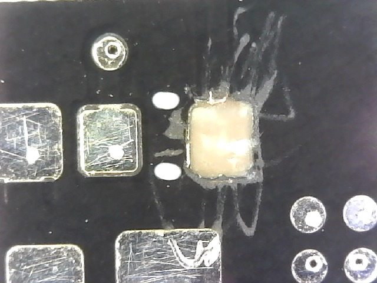

Sponsored By:

## Description

As a university student, avid hobbyist, skilled researcher, and budding professional, I frequently design and order PCBs for many different types of applications. A member of the PCBWay team reached out to me to gather my perspective as an individual designing and manufacturing PCBs across all of these disciplines. They offered to sponsor a quick project in exchange for this blog post.

## The Project

The board contains four identical buck converter ICs each routed in their own shielded section. The project explores the consequences of different routing mistakes for switching power converters.

1. Correct routing
2. Large input loop
3. Large switching loop
4. Poor control trace routing

I will release a future post covering more details about this project. Unfortunately, I did not have the time or budget to explore more fab-critical design areas such as HDI, impedance control, flex-PCBs, etc., but I hope to do this in the future.

## The Ordering Experience

My overall takeaway is that PCBWay offers a more professional ordering process with finer control over your PCBs than my experience with other PCB manufacturers like JLCPCB. Starting with the user interface, JLCPCB is great for inexperienced board designers, but I found PCBWay's ordering interface to be targeted towards users who will manually adjust manufacturing parameters to fit their application. Here are some areas where PCBWay offers many more options for manufacturing your board:

**Surface Finish**

PCBWay

JLCPCB

ENEPIG (Electroless Nickel Electroless Palladium Immersion Gold) is a luxurious option to have as a hobbyist. This is a process where an extra layer of palladium is added to reduce oxidation and improve wire-bonding capabilities, reliability, and shelf life. PCBWay is really living up to their mission to be a "full feature custom PCB prototype service" here.

**Advanced Options:**

I will let readers compare the advanced options for themselves for the sake of length, but PCBWay has a lot more to offer here. Most notably, they have a [Semi-Flex PCB](https://www.pcbway.com/blog/PCB_Basic_Information/Semi_Flex_PCB.html) service which is not offered by the majority of other PCB manufacturers.

**Cost**

The price of the board at PCBWay was $25.97 while the price at JLCPCB was $65.47. These prices are obtained from each website's quoting tools with identical gerber files and manufacturing options, except for a mandatory 4-wire Kelvin test that cost $16.86 at JLCPCB. It seems that with the right knowledge about what manufacturing features are required for your application, PCBWay can be a less expensive option. Note that these prices are just for manufacturing the board without assembly or shipping. I found the shipping and tariff prices to be nearly identical at around $30.

**Communication**

The communication during this project was fantastic. I received an email one day after I ordered my board notifying me that one of my components listed in my BOM had a lead time of over a week. They wanted to make sure I was okay with waiting for the components and that I did not urgently need the boards. I sent them an updated BOM without those components, they instantly updated my quoted price online, and continued with the manufacturing.

I received a second email with images of my assembled board, front and back. This is a wonderful touch, especially for someone ordering from the United States, as I can take a final look at the quality and component orientation before paying the larger shipping and tariff cost.

*Images sent by PCBWay*

## Board Quality

These images were taken with a low resolution USB microscope that I own.

**Continuity Testing -** We can see here that the flying probe testing was done as requested.

**Surface Finish:** The HASL finish was totally adequate for this project. This was the largest defect I could find with the bubbles and inconsistencies that can make HASL rework unreliable at scale.

**Silkscreen Quality:** I put these vias too close to the silkscreen, but they still avoided silkscreening over these vias. The silkscreen is legible with good contrast.

**Edge Cuts:** Clean and sharp with no chips or fragments.

**Durability:** The black solder mask was very thick and durable. I scratched at this pad with a 400°F iron, and it took me around 30 seconds of scratching to get it off. Even in this unrealistic test, the soldermask held up very well. I found that the board was plenty durable for soldering and reworking for a hobby project.

**Conclusion:**

Going in, I expected this to be a fairly standard "my sponsored board came out fine" post. However, the email about my BOM's lead time, the assembled board photos before shipping, and the fact that the board actually cost less than JLCPCB were not what I expected. The ordering experience really felt like my board was the most important board at their company. If PCBWay treats a one off hobby board this carefully, I can only imagine what the experience looks like at production scale.

If you are a student, researcher, or hobbyist who wants to move past JLCPCB's beginner friendly defaults and explore an expansive featureset, PCBWay is worth the (apparently smaller!) bill.
