## Project Overview

I have always been curious about the effects of PCB routing and how designers unintentionally add parasitics to their circuits. I also knew that playing with the parasitics and routing of the humble buck converter would teach me a lot about switching power conversion and help me apply this knowledge to more complicated topologies.

So, when PCBWay asked me to come up with a project to design a board with them, I designed an experiment on a PCB containing four MPQ4430 buck converters all routed differently with test points and labels to explore switching converter routing.

I was very busy with some serious research at the time they reached out to me, so this board was designed in a few hours with some late night coffee, and it shows in some spots. I forgot to remove the solder mask above the guard rails for each converter, but thankfully, this is mostly cosmetic. More significantly, I added a decimal to the output capacitor, so the BOM read 2.2uF instead of 22uF. The internal current mode controllers couldn't keep up with the large ripple, so I added some 47uF caps I found to fix the problem.

I won't go into the fundamental operation of the buck converter here, but you should be familiar with it before reading this article. Here are some good resources:

**TI Report on Switching Converter Fundamentals**
[https://www.ti.com/lit/an/snva559c/snva559c.pdf](https://www.ti.com/lit/an/snva559c/snva559c.pdf?ts=1789014971803&ref_url=https%253A%252F%252Fblogs.lcsc.com%252Fblog)

**Article on Output Voltage Ripple for Switching Converters**
[https://www.monolithicpower.com/en/learning/resources/output-voltage-ripple-measurement-and-reduction-for-dc-dc-voltage-regulators](https://www.monolithicpower.com/en/learning/resources/output-voltage-ripple-measurement-and-reduction-for-dc-dc-voltage-regulators?srsltid=AfmBOoovIHd8rcx4ozl4bvB-D-hCC2Q30nyjMbEasXtwWtrYMUZ_W7em)

## What Do We Expect

Before I touch a simulation or oscilloscope, I like to get a grasp of the theory behind what I am working with and develop some intuition. This saves hours of confusion, enables me to notice if anything is dangerously out of whack, and ensures you have enough knowledge to understand the real circuit. Here is my thought process about what we should expect for each converter:

**Correct Routing**:

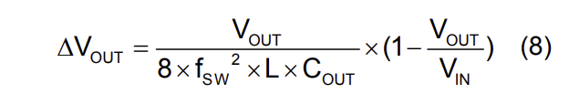

We obviously expect this to be normal operation. Using the output voltage ripple equation from the datasheet, VIN = 10 and VOUT = 5, we can calculate the ripple to be around 4.537mV. We expect there to be little high frequency noise on the output. By keeping our current loops small, we have minimized any parasitic inductance that would harm the performance of the converter and radiate noise.

**Large Input Loop:**
In this converter, the input capacitors are far from the IC, meaning there is a large loop between the "output" of the input capacitors and the input of the IC. This adds source inductance, which can cause poor transient response and a lot of electromagnetic noise. The loop area is around 22 times larger than the correctly routed version. In the worst case scenario, this inductance can create large voltage spikes that exceed the rating of our switches or cause a shoot through.

**Large Switching Loop**:
This is very similar to the above converter because it also creates a large parasitic inductance, except that it occurs after the switches. The main issue here is that this inductance experiences the high frequency 500kHz switching voltage of the converter, lending to large di/dts, voltage spikes, and noise. This can also resonate with the parasitic capacitance of our switches, adding high frequency ringing to our output.

**Poor Control Routing**
I expect the control trace to pick up a lot of high frequency switching noise. In the worst case, the feedback trace becomes so noisy that the converter cannot regulate the output to 5V. In another case, the converter may have reduced transient performance since the control takes longer to stabilize the output voltage when it is affected by noise.

## Probing Strategy

I used ground springs to shorten the current return path to my oscilloscope ground while probing the switching edges. This is slightly excessive for 500kHz, but it is good practice for when I deal with higher frequency converters.

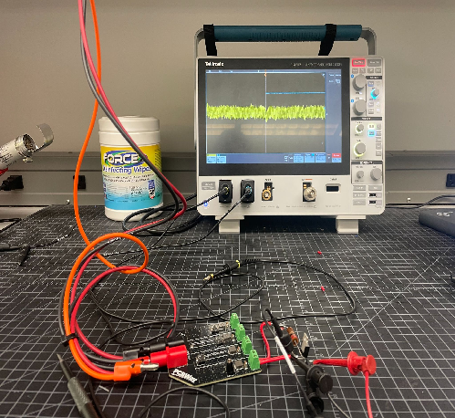

## Correct Routing

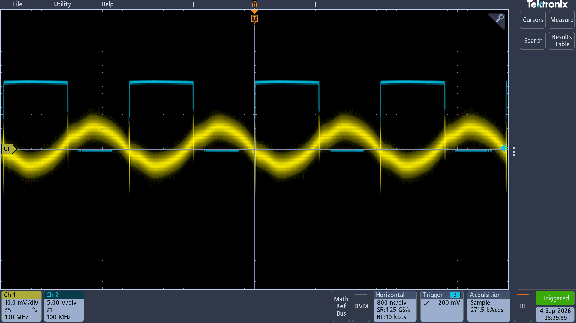

<strong>Blue: SW Yellow: Vout</strong>

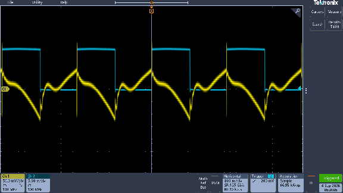

<strong>Blue: SW Yellow: Vin</strong>

We can see that the output ripple is around 15mV, which is reasonably close to our calculated value of 4.5mV without accounting for the output capacitor ESR. The AC coupled yellow trace shows only a slightly fuzzy 500kHz sine wave, meaning there is low HF ripple on the output.

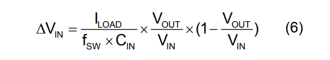

The calculated input ripple with our load drawing 1A is 22.7mV, which is almost exactly what we see here. We will see in the next converter that this is not the case.

## Large Input Loop

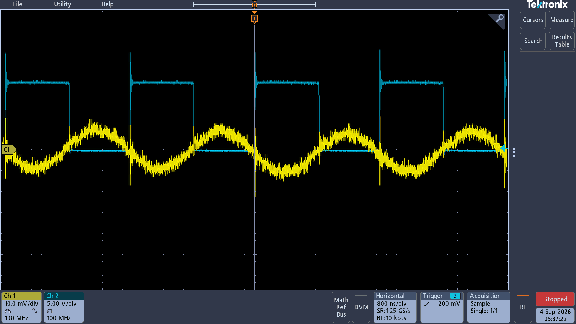

<strong>Blue: SW Yellow: Vout</strong>

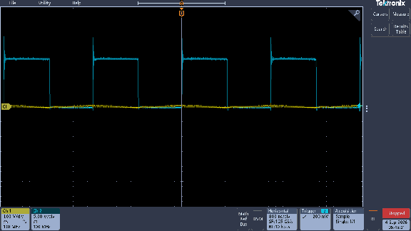

<strong>Probed at Input Cap</strong> <strong>Blue: SW Yellow: Vin</strong>

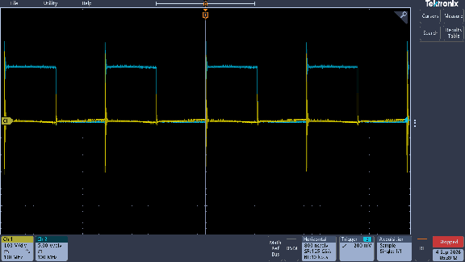

<strong>Probed at Test Point</strong> <strong>Blue: SW Yellow: Vin (at TP)</strong>

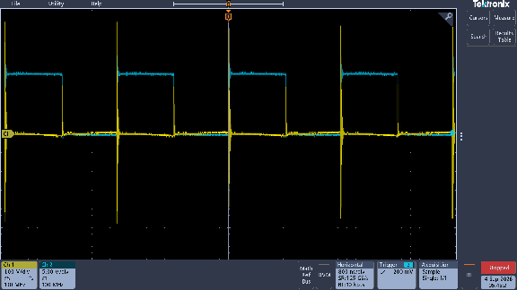

<strong>Probed at IC Pin</strong> <strong>Blue: SW Yellow: Vin (at IC)</strong>

Here, we see pretty clearly that the added input inductance created large voltage spikes and noise. The voltage spike is highest at the IC and lowest at the input capacitor. The difference between the two is the voltage drop across the parasitic loop inductance, caused by the input current spike when the high side switch turns on. In a larger converter, input inductance like this could mean that our converter could not source current quickly enough to store enough energy to power our load, leading to poor transient performance and inoperation. The spike in the switch trace overlaps with the voltage spike produced by our input loop inductance, showing how unnecessary EM noise can be produced by routing mistakes.

## Large Switching Loop

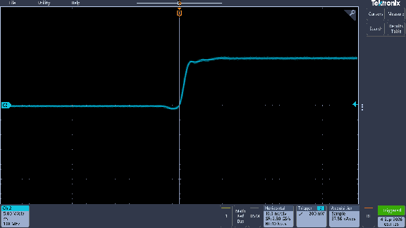

<strong>Correctly Routed SW</strong>

<strong>Large Switching Loop SW</strong>

My scope has a bandwidth of 100MHz, so we may not be able to see everything going on here. The output and input waveforms are identical to the correctly routed version. The time between peaks is around 3.5412ns, corresponding to a frequency of 282.4MHz which is above my scope's bandwidth.

However, I think this converter accidentally taught a more useful lesson. I increased the length of the switching trace to increase its inductance, but there is a solid ground plane underneath the whole trace. This means the loop area remains small because the dielectric thickness is only 12mil. The return current follows the path of least impedance directly underneath the SW trace, so the best way to increase the inductance for a future experiment would be to create a discontinuity in the ground plane and route the return current away from the SW trace.

## Poor Control Routing

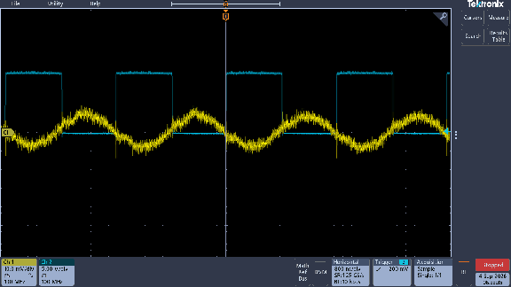

<strong>Blue: SW Yellow: Vout</strong>

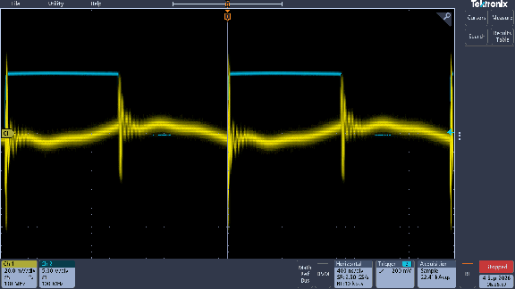

<strong>Blue: SW Yellow: FB</strong>

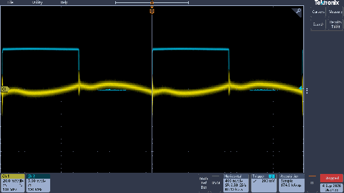

<strong>Correctly Routed</strong> <strong>Blue: SW Yellow: FB</strong>

The poorly routed control trace is still able to regulate the output to 5V. The correct converter outputted 4.9746V and the poorly controlled converter outputted 4.9731V, only a 1.5mV difference. However, we can see the noise picked up by the poor control trace. The voltage spike produced by the switching edge seems to resonate with parasitic capacitance to ground or the IC pin. It does not resonate for long, and the control trace settles to a waveform similar to that of the correctly routed converter, explaining why we don't see any difference in performance. If this converter was in a more harsh EM environment or the switching frequency was raised, the low performance of this control trace would hinder the converter's ability to regulate the output voltage and respond to transients.

## Load Step Response

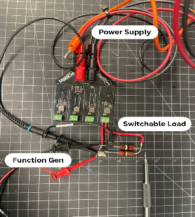

<strong>Load Step Response Setup</strong>

These routing mistakes can directly affect the load step response of the converter, so I created a primitive steppable load using two identical 22Ω resistors, a MOSFET, and a function generator to test transient response. The function generator was connected to the gate of the MOSFET, connecting and disconnecting a second resistor in parallel at 1kHz. I triggered on the rising edge of the function generator and was able to observe the output voltage transient for each converter.

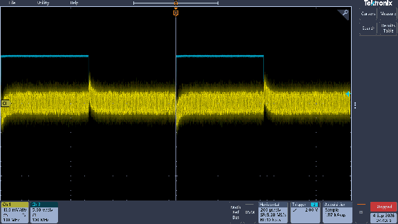

<strong>Correctly Routed</strong> <strong>Blue: Function Generator Yellow: Vout</strong>

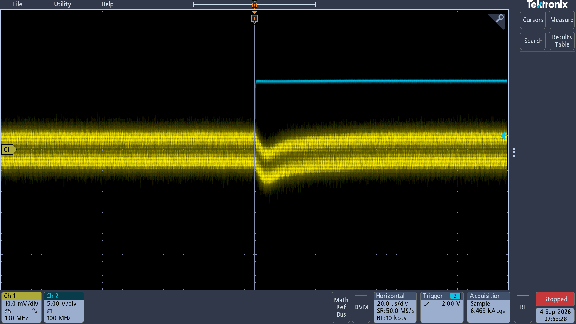

<strong>Bad Control Trace</strong>

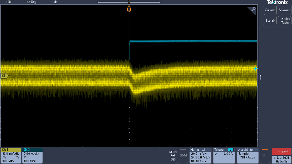

<strong>Large Input Loop</strong>

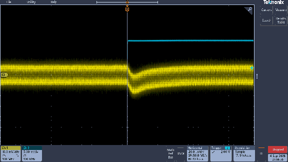

<strong>Correctly Routed</strong>

I was unable to observe an appreciable difference in the load step response between the converters. One reason for this may be that each converter has an identical and fairly large 47uF output capacitor. Storing more energy on the output side with a large output capacitor could mask some of the transient effects caused by poor routing, explaining why we do not see a difference. In a future experiment, I may test different component values and their effects on each converter.

## What I Learned

The most significant skill I developed through this project was an intuition for seeing and predicting return currents. I can now design boards with better foresight of current loops so I can minimize radiated emissions, increase the density of my designs, and confidently tackle high power converter designs. I also developed intuition about parasitic LC resonant tanks and how they appear around high frequency switching devices, decoupling capacitors, and odd trace geometries. Finally, I gained an appreciation for the ground plane and the work it does to reduce current loops for the PCB designer without much thought. I now know that if a design requires any discontinuities in the ground plane, all significant return current paths must be analyzed for large loops that can resonate, radiate, and pick up noise.
